# 오브 원정대
### 개발 기간: 25.04.22. - 25.04.29 (1주)
<aside>
"세계는 몬스터의 습격으로 파괴 직전, 
마지막 희망은 '원정대'를 꾸려 성장하고 싸우는 것! 
여러 힘을 지닌 영웅들을 모아 
시너지와 강화로 강력한 적들을 돌파하라!" 

---

**시너지를 구성하고, 파티를 성장시켜 목표 스테이지에 도달하는 파티 전략 게임**

</aside>

<aside>

### **게임잼 선정 주제**: 성장의 재미, 시너지X시너지X시너지

</aside>

<aside>

## 🤝 다양한 영웅을 고용해 나만의 원정대를 구성하세요!

</aside>

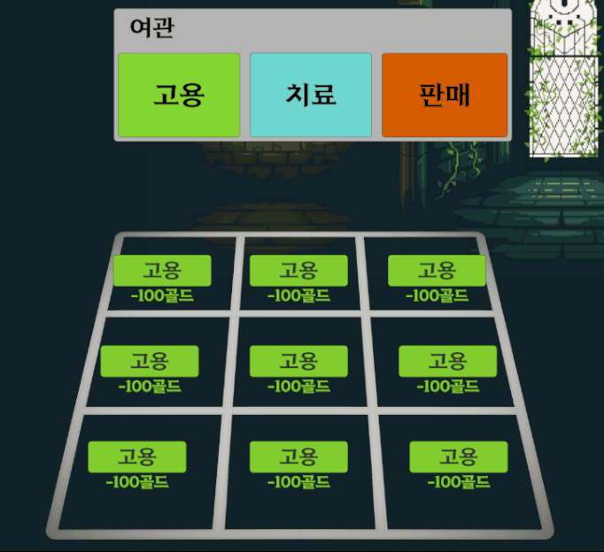

<aside>

## 🔥 직업과 세력을 조합해 터지는 시너지로 적들을 쓸어버리세요!

</aside>

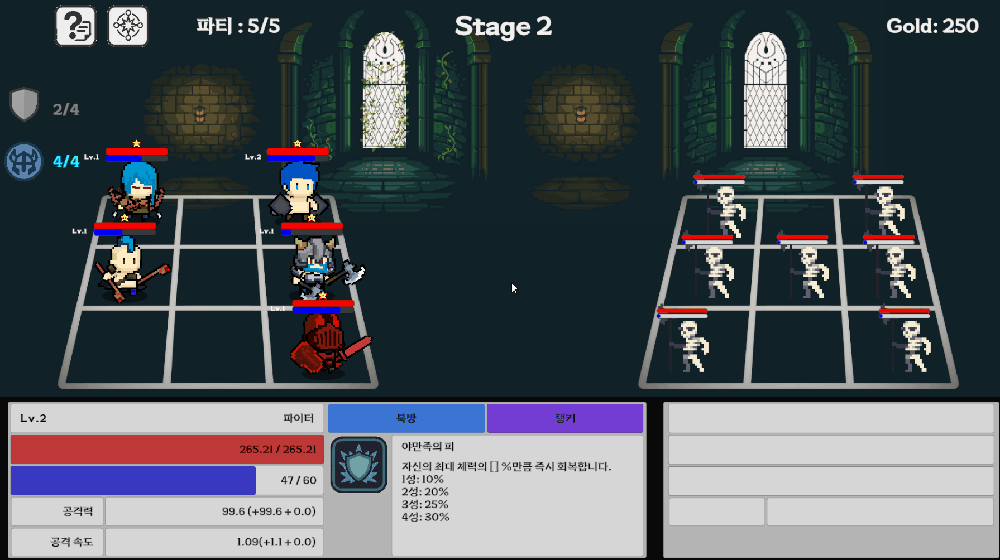

<aside>

## 🏆 최고의 조합을 완성해, 전설의 원정대가 되어보세요!

</aside>

# 핵심 경험

<aside>

> "실시간 강화와 시너지 폭발로 전장을 지배하는 2D 파티 성장 전투 게임!"
> 
</aside>

<aside>

## 💯성장의 성취감

</aside>

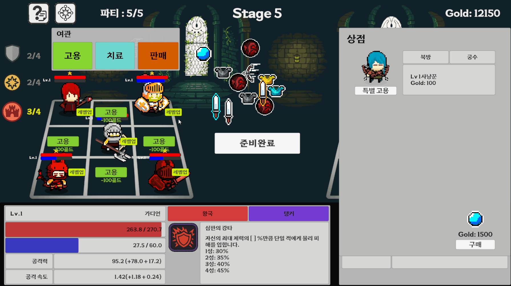

플레이어는 레벨업, 오브를 이용해 캐릭터를 성장시킬 수 있습니다.

## 👨‍🎓영구적인 강화 요소

<aside>

### **⚔ 레벨업과 오브**

</aside>

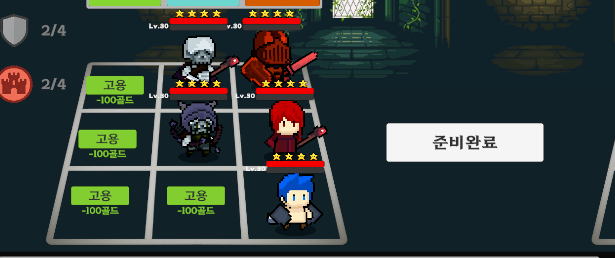

레벨업 시스템과 오브를 통해, 성장 방향을 스스로 결정할 수 있습니다.

- **레벨업**을 통한 **전체적인 성장**
- **오브**를 사용해 **특화된 부분으로 성장**

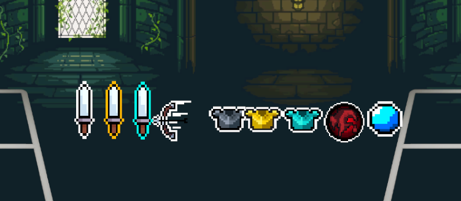

이 과정을 통해 '자신이 주도하는 성장곡선'을 체감하며, 강해진다는 확실한 성취감을 얻습니다.

<aside>

## 💥시너지가 폭발하는 짜릿함

</aside>

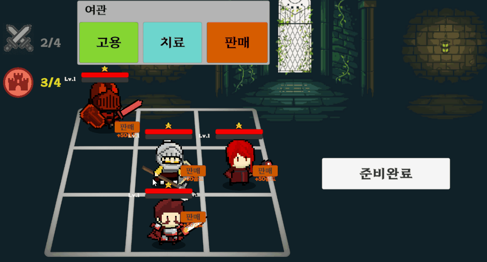

직업과 세력을 기반으로 한 시너지 시스템을 통해 전투력을 극적으로 상승시킬 수 있습니다.

<aside>

### **👨‍👨‍👦‍👦 독특하고 강력한 시너지**

</aside>

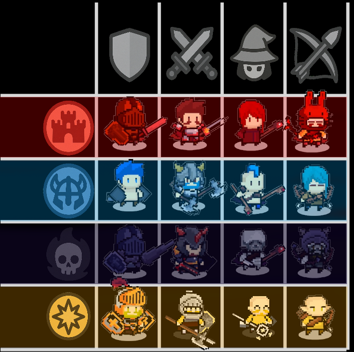

다양한 시너지 속 최적의 조합을 완성하는 순간 압도적인 쾌감을 느끼게 됩니다. 

<aside>

### 플레이테스트

</aside>

# 🤔이해되지 않는 게임은, 재미를 줄 수 있을까?

### ❗️문제의 본질

> 플레이어는 성장과 시너지의 재미를 느끼기 전에,
복잡한 시스템을 이해하는 데 에너지를 소모하고 있었습니다.
> 
> 
> 그렇기에 **시스템 이해를 돕고, 플레이 흐름을 자연스럽게 만드는 것**을 최우선 과제로 삼았습니다.
> 

<aside>

### **가설: "**직관성을 강화하면, 게임 구조를 쉽게 이해하고 성장과 시너지의 쾌감을 온전히 체험할 수 있다**."**

</aside>

# 🎮플레이테스트 결과

### 🎉전체 요약

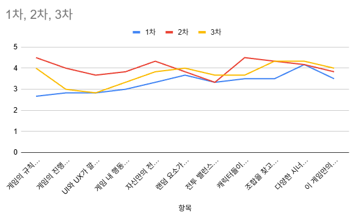

시스템 이해도와 재미를 느끼는 정도가 점진적으로 상승하는 것을 확인했습니다

<aside>

## 📊각 섹션별 설명

</aside>

### 🎯 튜토리얼 / 이해도

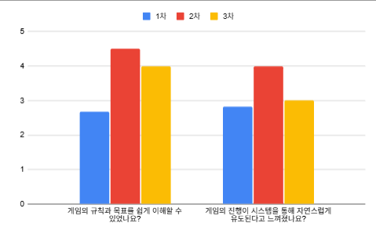

 규칙과 목표 이해를 중심으로 직관성과 가이드를 추가한 결과 개선된 모습을 보였습니다.

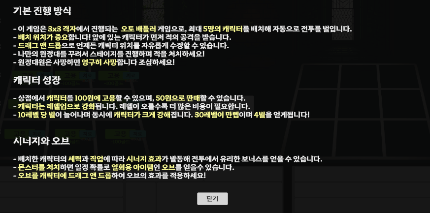

도움말 추가, 시너지표 추가 등으로 이해도를 올리려고 했습니다.

### **🧩 UX/UI / 피드백**

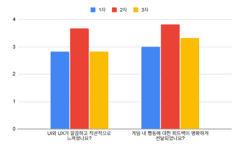

시스템 체감도 전반적으로 개선된 모습을 보였습니다.

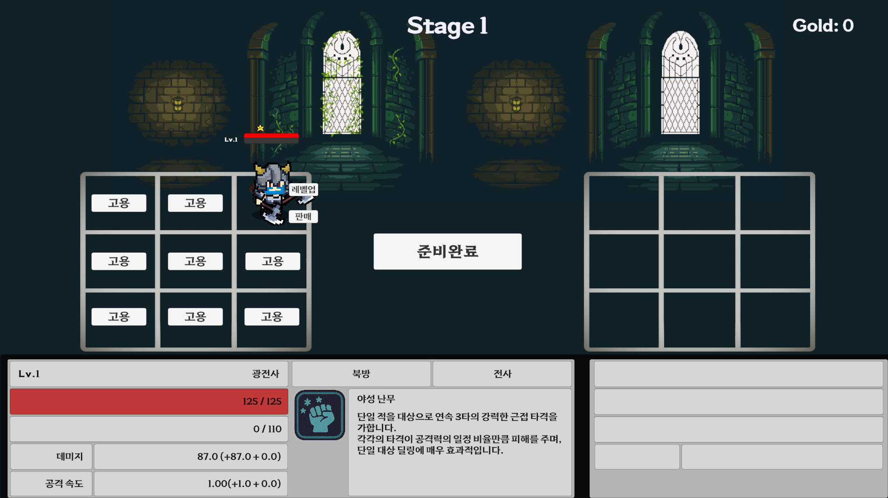

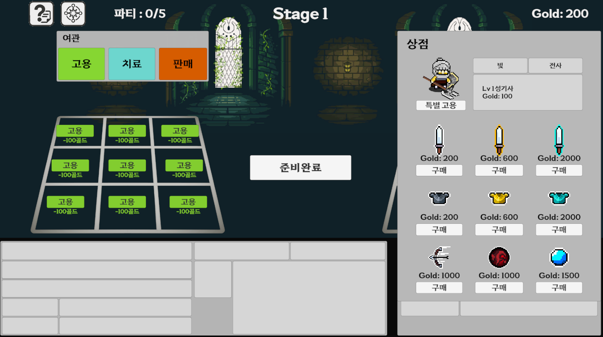

기존 Ui를 개선해 더 많은 정보를 직관적이고 확실하게 전달할 수 있도록 했습니다.

### 🧠 전략성과 밸런스

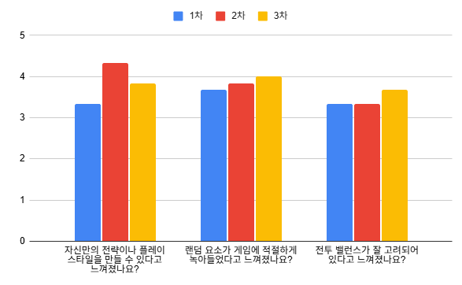

전략성과 전투 밸런스에 대한 경험도 점점 개선되었습니다.

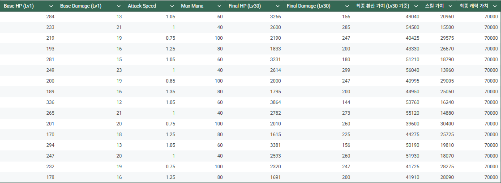

쓰이지 못하는 캐릭터가 없도록 디테일한 수치조절을 통해 다양한 전략이 사용 가능하도록 조정했습니다.

### 🌱 성장 및 조합의 감정 흐름

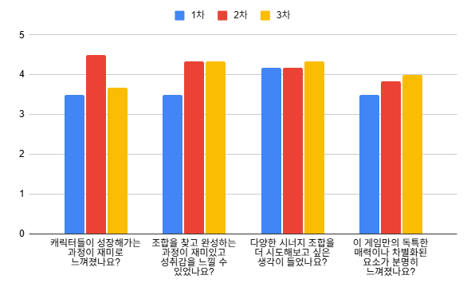

게임의 핵심 재미인 성장의 재미와 조합의 재미도 점점 명확하게 개선되었습니다.

 

오브와 레벨업시스템 또한 성장하는 재미를 위해 더욱 개선했습니다.

# 🏁결론

<aside>

### 가설은 대체로 검증되었습니다.

> 시스템 직관성 강화를 통해 플레이어는 더 빠르게 게임의 구조를 이해하고, 성장과 시너지의 재미를 더욱 명확하게 느낄 수 있었습니다. 특히 튜토리얼 및 가이드의 보완으로 초기 진입장벽이 낮아져 전체적인 시스템 이해도와 전략적 재미는 크게 개선되었습니다.
> 

> 하지만 UX/UI 피드백에서는 아직 명확한 개선 여지가 보였으며, 구현된 콘텐츠가 많아 플레이어에게 모든 요소가 완전히 직관적으로 전달되지 못한 부분이 남아 이후 개선할 여지로 남았습니다.
> 
</aside>

---

- **시너지 효과**
    
    
    | 직업 | 조건 (캐릭터 수) | 세력 | 조건 및 설명 |
    | --- | --- | --- | --- |
    | 🛡️ 탱커 | 2인: 체력 +10% 3인: 체력 +20% 4인: 체력 +40% | 🏰 왕국 연합 | 2인: 모든 능력치+10% 3인: 모든 능력치 +15%  4인: 모든 능력치 25% |
    | ⚔️ 전사 | 2인: 흡혈 +2.5% 3인: 흡혈 +50% 4인: 흡혈 +10% | 🏔️ 북방 부족 | 2인: 5%확률로 1회 더 공격 3인:10% 확률로 1회 더 공격 4인:20% 확률로 1회 더 공격 |
    | 🧙 마법사 | 2인: 마나 생산량 +10% 3인 : 마나 생산량 +20% 4인 : 마나 생산량 +40% | 🌑 어둠의 교단 | 4인: 50% 공격력 증가 |
    | 🗡️ 궁수 | 2인: 일반 공격 속도 +10%  3인: 일반 공격 속도 +20%  4인: 일반 공격 속도 +40% | ✨ 성광 교단 | 2인: 2초에 한번 가장 낮은 유닛 5% 회복 3인:  2초에 한번 가장 낮은 유닛 10% 회복 4인: 2초에 한번 가장 낮은 유닛 20% 회복 |

---

# 제작 회고

### 좋았던 점

---

짧은 개발 기간에도 불구하고 다양한 게임 요소를 밀도 있게 구현하고, 복합적인 밸런스 설계를 직접 경험해 볼 수 있어 좋았습니다.

- **8가지의 시너지 설계**
- **16 캐릭터의 능력치 및 스킬 밸런스**
- **상점 도입에 따른 골드와 능력치 가치 밸런스**
- **몬스터와 난이도 곡선의 세부 조정**

### 아쉬웠던 점

---

구현한 양이 많았고, 아무래도 설문을 기반으로 수정을 진행하다 보니 가시성과 직관성 문제에 집중될 수밖에 없었고, 이로 인해 초기에 계획했던 다양한 피처들을 상당수 포기한 점이 아쉬웠습니다.

- **다양한 적 바리에이션**
- **밸런스 시트 기반의 정교한 기능들**

특히 하루를 할애하여 설계한 밸런스 시트가 기능적 변경사항이 너무 많아 실제로 반영하지 못한 부분이 
많이 아쉬웠습니다.
